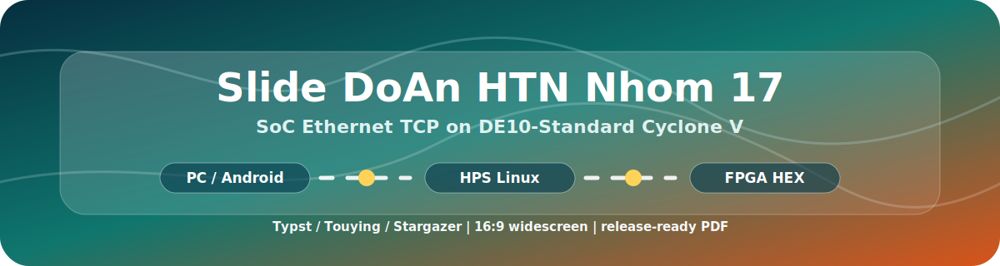
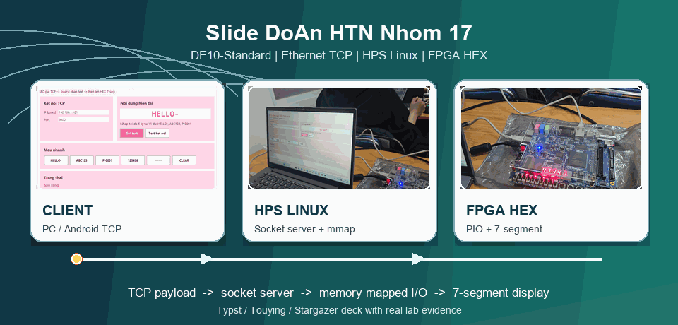
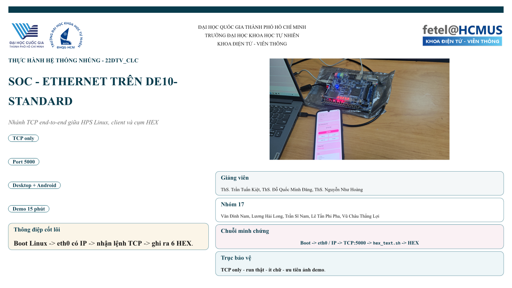

<p align="center">
  
</p>

<h1 align="center">🖼️ Slide Đồ án Hệ thống nhúng · Nhóm 17 · DE10-Standard 🖼️</h1>

<p align="center">
  <a href="https://github.com/lhlizdabezt/Slide-DoAnHTN-Nhom17-DE10Standard/releases/latest"></a>
  
  
  
  
</p>

<p align="center">
  
</p>

---

## 🎯 Tóm tắt

Repo này lưu bộ slide bảo vệ cho **Đồ án Hệ thống nhúng - Nhóm 17 (22DTV_CLC)**, chủ đề **SoC FPGA nhận lệnh TCP/Ethernet từ PC hoặc Android, xử lý trên HPS/Linux và hiển thị lên LED 7 đoạn của DE10-Standard Cyclone V**.

Slide được viết bằng **Typst/Touying** với theme **Stargazer** tự chỉnh, dùng khung 16:9, ảnh demo thật, bảng đối chiếu yêu cầu học phần và luồng minh chứng end-to-end. Mục tiêu của repo là để người xem không chỉ thấy file trình chiếu, mà còn thấy rõ bối cảnh kỹ thuật, cách build lại, bằng chứng demo và liên kết với repo source của đồ án.

## 🔗 Liên kết nhanh

| Hạng mục | Liên kết |
| --- | --- |
| PDF release mới nhất | [Tải tại GitHub Releases](https://github.com/lhlizdabezt/Slide-DoAnHTN-Nhom17-DE10Standard/releases/latest) |
| Source code đồ án | [DoAnHeThongNhung](https://github.com/lhlizdabezt/DoAnHeThongNhung) |
| Hồ sơ GitHub | [lhlizdabezt](https://github.com/lhlizdabezt) |
| Profile README | [lhlizdabezt/lhlizdabezt](https://github.com/lhlizdabezt/lhlizdabezt) |

## 🧩 Bộ slide gồm gì

| Nhóm nội dung | Bằng chứng trong slide | Giá trị khi đánh giá |
| --- | --- | --- |
| Bài toán SoC/Ethernet | Mục tiêu TCP-only, port 5000, client desktop và Android | Cho thấy phạm vi bảo vệ rõ, không ôm đồm nhiều nhánh chưa kiểm chứng |
| Nền tảng phần cứng | DE10-Standard Cyclone V, HPS/Linux, MSEL, microSD, USB-UART | Chứng minh nhóm có xử lý bring-up board thật, không chỉ làm giao diện |
| Đường dữ liệu | Client gửi payload qua TCP, HPS nhận bằng socket server, ghi ra ngoại vi FPGA | Thể hiện luồng tích hợp phần mềm - Linux - FPGA theo từng tầng |
| Kiểm thử tối thiểu | Contract payload 6 ký tự, ảnh laptop GUI, ảnh board HEX, ảnh Android | Người xem có dấu hiệu trực quan để đối chiếu với kết quả chạy thật |
| Tài liệu trình bày | Theme Typst/Stargazer, bố cục 10 slide, preview và release PDF | Dễ build lại, dễ đọc, phù hợp để nộp và đưa vào portfolio |

## 🖼️ Preview

<p align="center">
  
</p>

## 🗺️ Slide map

| # | Slide | Nội dung chính |
| --- | --- | --- |
| 1 | Mở đầu | Tên đồ án, nhóm, giảng viên, logo VNU-HCM/HCMUS/FETEL và thông điệp cốt lõi |
| 2 | Phạm vi bảo vệ và tuyến demo | Thu hẹp về nhánh TCP đã chạy thật, desktop + Android, board DE10-Standard |
| 3 | Kiến trúc end-to-end | PC/Android ↔ TCP/Ethernet ↔ HPS/Linux ↔ FPGA/PIO ↔ LED 7 đoạn |
| 4 | Nền tảng phần cứng và bring-up | MSEL, microSD, USB-UART, boot Linux, IP mạng và điều kiện vận hành |
| 5 | Lõi TCP trên board | Socket server, payload, `hex_text.sh`, ghi dữ liệu ra cụm HEX |
| 6 | Contract dữ liệu và kiểm thử | Quy ước payload 6 ký tự, kiểm thử theo tầng và ranh giới dữ liệu |
| 7 | Hai đầu cuối điều khiển | Desktop GUI và Android client cùng gửi về một endpoint TCP |
| 8 | Minh chứng chạy thật | Ảnh laptop, board và điện thoại trong bối cảnh lab thật |
| 9 | Đối chiếu yêu cầu học phần | Mapping yêu cầu học phần với hiện vật kỹ thuật đã làm được |
| 10 | Kết luận | Tóm tắt chuỗi SoC - Ethernet và hướng mở rộng hợp lý |

## 🛠️ Build lại PDF

Yêu cầu chính:

| Công cụ | Vai trò |
| --- | --- |
| Typst `0.14.x` | Biên dịch `main.typ` thành PDF hoặc PNG |
| Touying package | Nền trình chiếu Typst được import trong `stargazer.typ` |
| Font hệ thống | Times New Roman/Courier New trên Windows; Typst có fallback nếu thiếu font phụ |

Lệnh build:

```bash
typst compile main.typ Slide-DoAnHTN-Nhom17-DE10Standard.pdf
```

Xuất ảnh preview slide đầu:

```bash
typst compile main.typ assets/slide-preview-01.png --pages 1 --ppi 96
```

Khi kiểm tra trên máy Windows hiện tại, deck build thành công. Typst chỉ báo cảnh báo fallback cho một vài font phụ như `Liberation Serif`, `DejaVu Serif` và `Liberation Mono`; PDF vẫn được xuất bình thường vì Windows có Times New Roman/Courier New.

## 📁 Cấu trúc repo

```text
.
├── main.typ                 # Entry point của deck 10 slide
├── stargazer.typ            # Theme Typst/Touying: panel, badge, phase, footer, layout 16:9
├── assets/                  # Ảnh demo board/GUI/Android, preview PNG và GIF motion
├── images/                  # Logo VNU-HCM, HCMUS và FETEL
├── docs/banner.svg          # Banner SVG, text không dấu/English để tránh lỗi font dấu
├── RELEASE_NOTES.md         # Ghi chú release theo phiên bản
└── LICENSE                  # MIT cho theme/macro; ảnh và nội dung kỹ thuật có phạm vi riêng
```

## 👥 Thông tin học phần

| Mục | Nội dung |
| --- | --- |
| Học phần | Thực hành Hệ thống nhúng |
| Lớp | 22DTV_CLC |
| Nhóm | Nhóm 17 |
| Thành viên | Văn Đình Nam, Lương Hải Long, Trần Sĩ Nam, Lê Tấn Phi Pha, Vũ Châu Thắng Lợi |
| Trường | Trường Đại học Khoa học Tự nhiên, ĐHQG-HCM |
| Khoa | Khoa Điện tử - Viễn thông |

## ✅ Phạm vi trung thực

Repo này tập trung vào **slide trình bày** và các asset trực quan của buổi bảo vệ. Source code, báo cáo đầy đủ và các file Quartus/Python/C liên quan nằm ở repo [DoAnHeThongNhung](https://github.com/lhlizdabezt/DoAnHeThongNhung). README không cố biến slide thành một sản phẩm thương mại; nội dung được trình bày theo hướng portfolio kỹ thuật: rõ bài toán, rõ công nghệ, rõ bằng chứng, rõ cách build.

## 📌 Repo liên quan

| Repo | Vai trò |
| --- | --- |
| [DoAnHeThongNhung](https://github.com/lhlizdabezt/DoAnHeThongNhung) | Repo source chính của đồ án SoC/Ethernet trên DE10-Standard |
| [embedded-systems-fpga-review-labs](https://github.com/lhlizdabezt/embedded-systems-fpga-review-labs) | Lab FPGA/SoPC, Verilog, Avalon-MM, Nios II và PIO/DMA |
| [HCMUS-DTVT-BaoCao-Templates](https://github.com/lhlizdabezt/HCMUS-DTVT-BaoCao-Templates) | Bộ template báo cáo học thuật cho Điện tử Viễn thông HCMUS |
| [lhlizdabezt](https://github.com/lhlizdabezt) | Portfolio GitHub của Lương Hải Long |

## 📄 License

- Theme `stargazer.typ`, macro và layout slide: **MIT License**, xem [LICENSE](LICENSE).
- Nội dung kỹ thuật, ảnh demo trong `assets/` và logo trong `images/`: thuộc phạm vi học phần/portfolio của Lương Hải Long và Nhóm 17. Không dùng lại để nộp thay đồ án, báo cáo hoặc sản phẩm học thuật khác.

<p align="center">
  <sub>Typst · Touying · Stargazer · DE10-Standard · HPS/Linux · TCP/Ethernet · FPGA HEX</sub>
</p>
