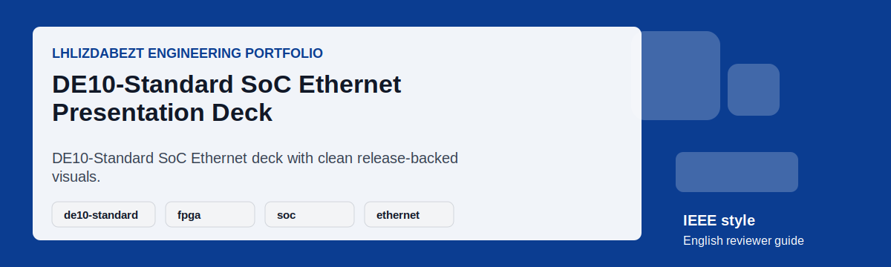

# DE10-Standard SoC Ethernet Presentation Deck

## Executive Summary

This repository presents a technical slide deck for a DE10-Standard SoC Ethernet project. The public wrapper emphasizes presentation discipline, FPGA/SoC communication context, Typst/Touying authoring, release-backed slide previews, and reviewer-ready English framing.

## Project Snapshot

| Field | Details |
|---|---|
| Repository | [lhlizdabezt/Slide-DoAnHTN-Nhom17-DE10Standard](https://github.com/lhlizdabezt/Slide-DoAnHTN-Nhom17-DE10Standard) |
| Portfolio Track | Technical presentation, DE10-Standard, SoC Ethernet, Typst, Touying, and release-backed slide assets |
| Public Status | Reviewer-ready English guide with release-backed evidence |
| Latest Release | [Open stable release](https://github.com/lhlizdabezt/Slide-DoAnHTN-Nhom17-DE10Standard/releases/latest) |
| Owner Profile | [lhlizdabezt](https://github.com/lhlizdabezt) |
| Contact | 22207056@student.hcmus.edu.vn; luonghailong.work@gmail.com; Tel: +84988114708 |

## Reviewer Evidence Map

- Typst/Touying slide sources and generated visual previews.
- Project images and deck assets that support the SoC Ethernet narrative.
- English reviewer guide for HR, seminar, and engineering review.
- Release packaging that provides a stable presentation snapshot.

## Implementation Review Notes

| Review Point | What To Check |
|---|---|
| Problem framing | Confirm that the README explains the engineering purpose without exaggerated claims. |
| Technical evidence | Inspect the source folders, reports, scripts, schematics, or visual assets listed below. |
| Reproducibility | Use the local instructions where tools are available, or rely on the release snapshot for portfolio review. |
| Communication quality | Check headings, captions, tables, and release notes for clear English technical writing. |
| Professional boundary | Treat the repository as educational or portfolio evidence unless the source explicitly proves production deployment. |

## Repository Structure

| Path | Reviewer Purpose |
|---|---|
| `main.typ` | Primary Typst slide deck entry point. |
| `src/` | Slide sections or supporting Typst modules when available. |
| `assets/` | Slide previews, motion GIFs, and reviewer-safe images. |
| `RELEASE_NOTES.md` | Release changelog for the English reviewer guide. |

## How To Review

- Start with this README to understand the DE10-Standard communication context.
- Review the slide source and visual preview images before compiling locally.
- Check the latest release for a stable public presentation snapshot.
- Assess clarity, technical sequencing, and visual communication rather than only code volume.

## How To Use Or Inspect Locally

- Install Typst and the required slide-deck packages if you want to build locally.
- Run `typst compile main.typ` from the repository root when dependencies are available.
- Review `assets/slide-preview-01.png` and the motion GIF for a quick visual scan.
- Use the release page when you need the reviewed portfolio state.

## Visual Evidence

*Animated English reviewer card.*

*Slide preview image.*

## Release, Tags, And Topics

- Current release target: `reviewer-guide-2026-06-02`.
- Recommended topic set: `de10-standard, fpga, soc, ethernet, typst, touying, slides, technical-presentation, hps-linux, embedded-systems`.
- Release notes are maintained in [`RELEASE_NOTES.md`](RELEASE_NOTES.md) for stable reviewer traceability.
- The release archive is intended for HR review, seminar evidence, and academic portfolio verification.

## Contact And Professional Links

| Channel | Link |
|---|---|
| GitHub | [https://github.com/lhlizdabezt](https://github.com/lhlizdabezt) |
| LinkedIn | [https://www.linkedin.com/in/lhlizdabezt](https://www.linkedin.com/in/lhlizdabezt) |
| Facebook | [https://www.facebook.com/wageseadrake](https://www.facebook.com/wageseadrake) |
| Instagram | [https://www.instagram.com/lhlizdabezt](https://www.instagram.com/lhlizdabezt) |
| YouTube | [https://www.youtube.com/@lhlizdabezt](https://www.youtube.com/@lhlizdabezt) |
| TikTok | [https://www.tiktok.com/@wageseadrake](https://www.tiktok.com/@wageseadrake) |
| Academic Email | [22207056@student.hcmus.edu.vn](mailto:22207056@student.hcmus.edu.vn) |
| Professional Email | [luonghailong.work@gmail.com](mailto:luonghailong.work@gmail.com) |
| Phone | [+84988114708](tel:+84988114708) |

## FAQ

| Question | Answer |
|---|---|
| Is this a software repository or a deck repository? | It is primarily a technical presentation repository with release-backed visual assets. |
| What is the engineering focus? | DE10-Standard SoC communication, technical explanation, and presentation clarity. |
| Why use Typst/Touying? | They provide reproducible slide authoring and clean academic formatting. |

## Scope And Boundaries

- This repository is presented as public engineering portfolio evidence.
- Claims are intentionally limited to what the repository, report, source files, simulations, or visual assets can support.
- Public text is written in English (United States) for HR, faculty, and engineering reviewers.
- SVG text is kept ASCII-safe to reduce rendering errors, mojibake, and missing-glyph blocks.
- Motion visuals avoid moving dotted paths, curved connector lines, and text-over-line compositions.

## Writing Standard

The public README, release notes, captions, and reviewer-facing metadata are written in a restrained IEEE and Harvard-inspired style: concise, evidence-first, technically accurate, and suitable for Electronics and Telecommunications portfolio review.
